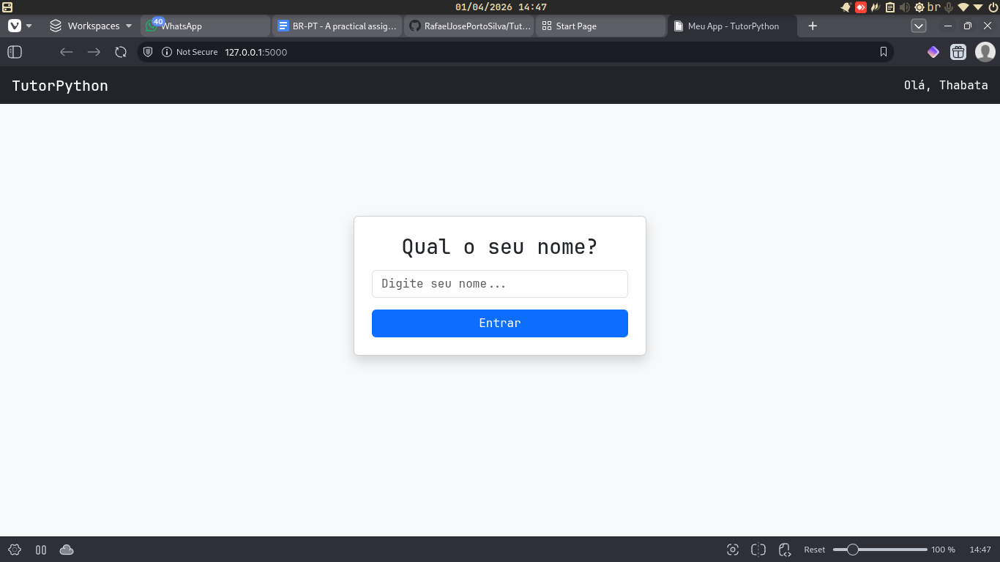
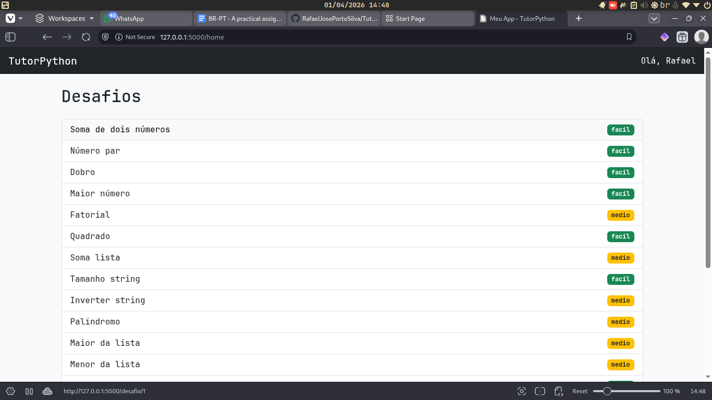
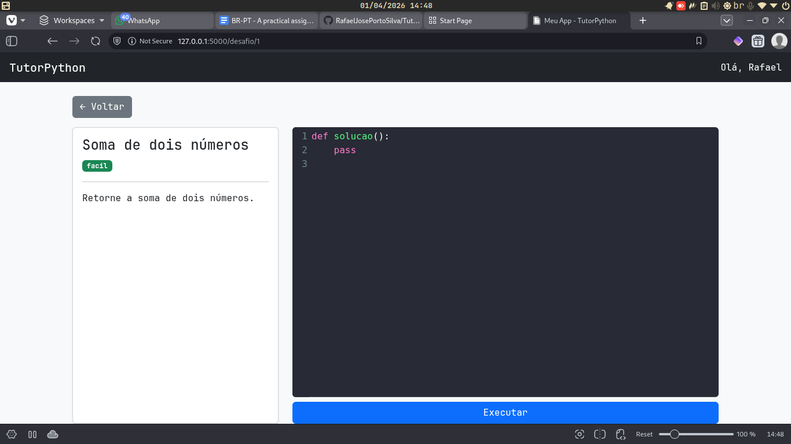
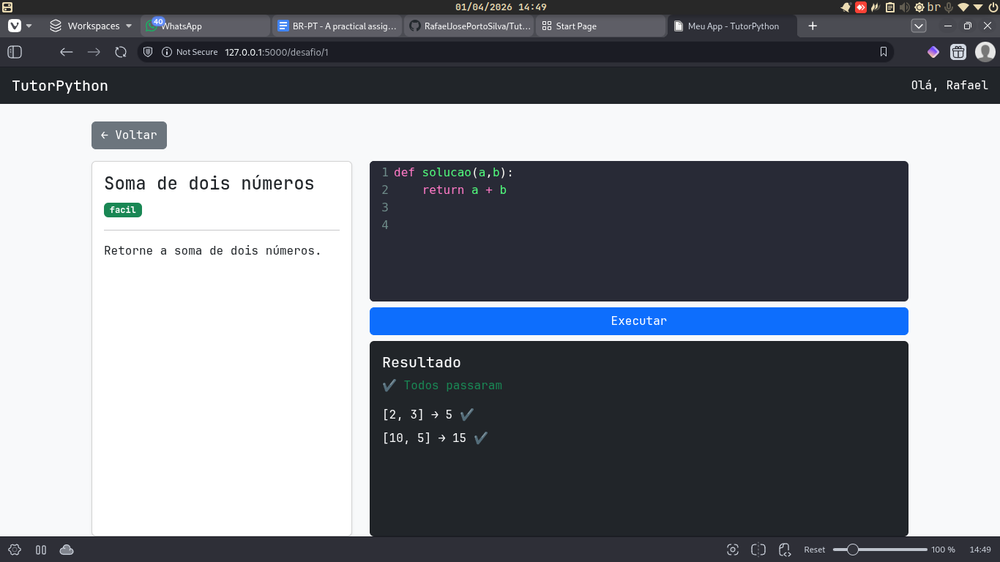

# TutorPython (Flask)

Aplicação web para prática de programação em Python, inspirada em plataformas como LeetCode, mas com foco em simplicidade e aprendizado.

Este projeto foi desenvolvido como teste prático para uma vaga de tutor de programação.

---

## Funcionalidades

- Identificação do usuário (nome)
- Listagem de desafios com níveis de dificuldade
- Visualização individual de desafios
- Editor de código com destaque de sintaxe (CodeMirror)
- Execução de código com múltiplos casos de teste
- Feedback para cada teste

---

## Tecnologias utilizadas

- Python
- Flask
- SQLAlchemy
- Jinja2
- Bootstrap
- CodeMirror

---

## Instalação

```bash
python -m venv venv

# Linux/macOS
source venv/bin/activate  

# Windows
venv\Scripts\activate     

pip install -r requirements.txt
```

## Executando o projeto
```bash
python run.py
```

A aplicação estará disponível em:
http://127.0.0.1:5000

## Popular o banco de dados

### Para inserir desafios de teste:
```bash
python seed.py
```

## Funcionamento do sistema

O projeto utiliza um padrão de arquitetura que separa os comandos executáveis e demais arquivos de configuração daqueles que serão utilizados internamente pelo servidor durante o funcionamento.

Dentro de app/ foi separada apenas a camada de service. Nos demais arquivos, as classes foram mantidas todas juntas para evitar aumento de complexidade desproporcional ao projeto.

O __init__.py separado de run.py,que juntos substituem o app.py - o padrão da documentação - é uma adaptação para app/ funcionar sem problemas com importação dos módulos, e centralizar as dependências: o que torna o código mais adaptável.

Fluxo básico:

1. Usuário informa o nome

2. Sistema armazena na session
3. Lista de desafios é exibida

4. Usuário seleciona um desafio
5. Código é enviado para o backend

6. O sistema executa os testes automaticamente
7. Resultado é exibido na tela


## Observações
O uso de eval foi utilizado para simplificar a execução dos testes. Não é recomendado para ambientes de produção

## Autor

Rafael José Porto Silva